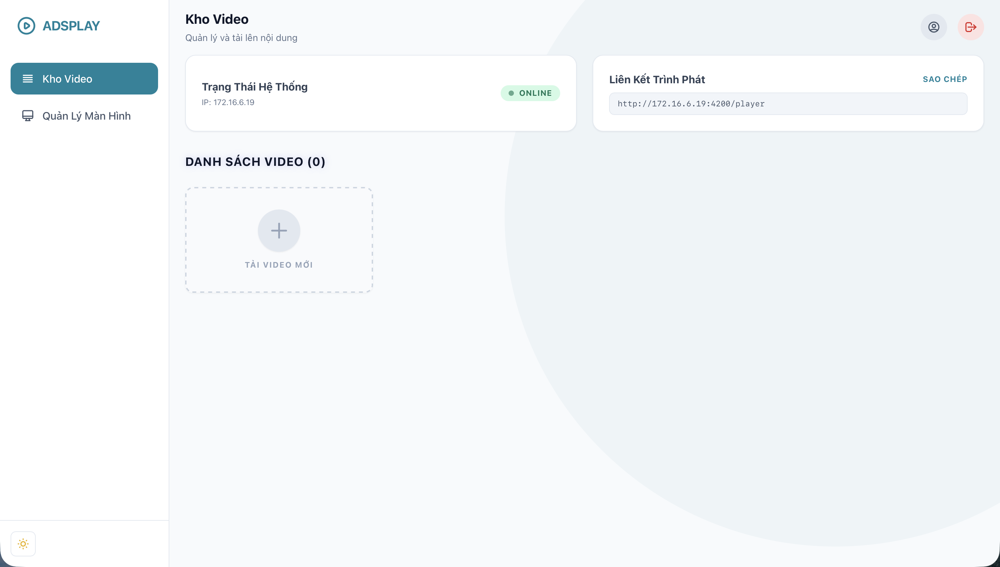

<div align="center">
  <h1>AdPlay</h1>
  <p><b>Local digital signage for TVs, tablets, and menu boards.</b></p>

  
  
  
  
</div>



## What Is AdPlay?

AdPlay lets you run digital signage on your local network without depending on a cloud service.

You can:
- upload videos and images
- group them into playlists called **Profiles**
- open the player on TVs, tablets, or monitors
- assign a different profile to each screen

It is designed for places like:
- cafes
- restaurants
- retail stores
- offices
- reception desks

## Who This README Is For

This README is written for two groups:

1. **Non-technical users**
Use the quick start section to get the system running and show videos on a screen.

2. **Developers / people forking the project**
Use the developer sections to understand the codebase, local development flow, media pipeline, and where to make changes.

---

## Quick Start For Non-Technical Users

### What you need

- A computer that will host AdPlay
- A TV, tablet, or monitor on the same Wi-Fi or LAN
- Node.js installed on the host computer

### First launch

- The first launch may take a few minutes because AdPlay can install dependencies and build the app automatically
- AdPlay creates `backend/.env` for local settings if it does not exist yet
- AdPlay writes `AdPlay Access.txt` with the admin URL, player URL, and login details
- Your browser should open automatically to the admin dashboard

### Start the app

#### macOS / Linux

Double-click:

```text
start.command
```

Or run in Terminal:

```bash
./start.sh
```

#### Windows

Double-click:

```text
start.bat
```

### Open the admin dashboard

```text
http://localhost:3000/admin
```

Default local login:

- Username: `admin`
- Password: `admin`

### Add content

1. Upload one or more videos or images
2. Create a Profile
3. Add content into that Profile's playlist

Supported upload formats:

- Videos: `MP4`, `WebM`, `OGG`, `MOV`
- Images: `JPG`, `PNG`, `GIF`, `WebP`

The admin library can preview both videos and images directly, so you do not need to open the player just to verify an ad.

### Open the player on a TV or tablet

1. Make sure the screen device is on the same local network
2. Open `AdPlay Access.txt` or copy the player link from the dashboard
3. Open that address in the TV or tablet browser
4. Choose a profile and start playback

On first open, AdPlay pairs that browser automatically for heartbeat and then removes the token from the visible address bar.

If the TV has an old browser, use the legacy link from the dashboard:

```text
http://192.168.1.50:3000/player-legacy/profile-name?token=...
```

Example:

```text
http://192.168.1.50:3000/player
```

### Important notes

- Keep the AdPlay window or terminal open while the system is running
- The first tap on a TV may be needed to enable sound or fullscreen
- Large uploads may continue in chunks if the network is unstable
- Videos may be optimized in the background after upload
- AdPlay also creates poster images for the admin library when processing succeeds
- Image ads are ready immediately after upload and can be mixed into the same playlist as videos
- The modern player prefers HLS playback automatically and falls back to direct MP4 streaming if needed
- Mixed playlists rotate through both videos and still images automatically
- After the first successful open, the player keeps its pairing token locally so the visible TV URL stays clean

---

## Quick Troubleshooting

### I cannot open the admin page

- Make sure the app is still running
- Use `http://localhost:3000/admin`
- If the browser did not open automatically, check `AdPlay Access.txt`

### My TV cannot load the player

- Make sure the TV is on the same Wi-Fi/LAN
- Use the host computer's local IP, not `localhost`
- Check whether your firewall is blocking local access
- If the TV browser is very old, use the legacy player link from the dashboard instead of the standard player
- If a screen stops showing as online, open its dashboard link once more to refresh the local pairing token

### Upload feels slow

- AdPlay now uploads in chunks, so unstable networks are handled better
- Very large files still depend on local network speed
- Videos may keep processing after the upload reaches 100%

### Video uploaded but is still processing

- That is normal
- AdPlay uploads first, then optimizes in the background
- If optimization does not improve the file, AdPlay keeps the original video

### My image uploaded but does not play like a video

- That is expected
- Images are displayed as still ads in the player
- They can live in the same playlist as videos
- Use the preview button in the admin library to confirm the image before publishing

---

## Developer Quick Start

### Install dependencies

Backend:

```bash
cd backend
npm install
```

Frontend:

```bash
cd frontend
npm install
```

### Run locally

Backend:

```bash
cd backend
npm run dev
```

Frontend:

```bash
cd frontend
npm run start
```

### Build

Backend:

```bash
cd backend
npm run build
```

Frontend:

```bash
cd frontend
npm run build
```

### Test

Backend:

```bash
cd backend
npm test
```

Frontend:

```bash
cd frontend
npm run test:ci
```

---

## Codebase Map

### Top level

- `frontend/` Angular admin UI and player UI
- `backend/` Express API, upload handling, media streaming, local JSON storage
- `launch-adplay.cjs` one-click launcher used by the helper scripts
- `start.command` double-click launcher for macOS
- `start.sh` Terminal launcher for macOS/Linux
- `start.bat` double-click launcher for Windows

### Frontend

- `frontend/src/app/features/dashboard/`
  Admin dashboard for uploads, media previews, profiles, and system status
- `frontend/src/app/features/player/`
  Screen player experience used on TV/tablet devices, including mixed image/video playlists
- `frontend/src/app/features/auth/`
  Admin login flow
- `frontend/src/app/services/`
  API and auth services
- `frontend/src/app/shared/`
  Shared UI components, toasts, helpers

Important frontend files:

- `frontend/src/app/features/dashboard/admin.ts`
- `frontend/src/app/features/dashboard/dashboard.store.ts`
- `frontend/src/app/features/dashboard/resumable-upload.service.ts`
- `frontend/src/app/features/player/player.ts`
- `frontend/src/app/features/player/player-session.service.ts`
- `frontend/src/app/services/api.service.ts`

### Backend

- `backend/src/routes/`
  Express routes
- `backend/src/services/`
  Business logic
- `backend/src/middleware/`
  Auth, logging, request IDs, error handling
- `backend/src/db.ts`
  Local JSON-backed repository
- `backend/src/config.ts`
  Environment config and paths

Important backend files:

- `backend/src/app.ts`
- `backend/src/routes/video.routes.ts`
- `backend/src/routes/profile.routes.ts`
- `backend/src/services/video.service.ts`
- `backend/src/services/media.service.ts`
- `backend/src/services/upload-session.service.ts`
- `backend/src/db.ts`

---

## How The App Works

### Basic flow

1. Admin logs in
2. Admin uploads videos
3. Backend stores the uploaded file locally
4. Backend creates a video record in `db.json`
5. Backend may optimize the video in the background with FFmpeg
6. Admin creates profiles and assigns videos to them
7. A player device opens `/player/:profileSlug`
8. The player requests profile data and prefers HLS playback when available
9. If HLS is unavailable or unsupported, the player falls back to direct file streaming from the backend

### Storage model

AdPlay uses local file storage plus a local JSON database.

- uploaded video files live under `backend/uploads/`
- processed videos live under `backend/uploads/processed/`
- resumable upload session state lives under `backend/uploads/.sessions/`
- app data lives in `backend/db.json`

This keeps the project simple to run and easy to fork, but it is not meant to be a distributed storage architecture.

---

## Media Pipeline

AdPlay now has a more complete media pipeline than a simple single POST upload.

### Uploads

- uploads are **resumable**
- files are uploaded in chunks
- interrupted uploads can continue instead of restarting from zero

### Processing

- after upload, the backend may optimize the video with FFmpeg
- optimization happens in-process in the current server
- if the optimized file is smaller and usable, AdPlay serves it
- if optimization is worse, AdPlay keeps the original file
- the backend also generates a poster image for the admin media library
- the backend also generates a single-variant HLS playlist for the modern player when processing succeeds

### Streaming

- modern playback prefers `/api/videos/:id/hls/playlist.m3u8`
- playback falls back to `/api/videos/:id/stream` when HLS is not available
- the backend supports HTTP range requests for direct file streaming
- small ready videos may be cached by the player
- large videos stream directly to avoid wasting browser memory

### Current limitation

This is a strong local-first media pipeline, but it is still not a full media platform:

- no distributed job queue
- no multi-bitrate adaptive HLS/DASH ladder
- no object storage / CDN integration
- no thumbnail sprite generation for seek previews

---

## Environment Variables

The one-click launcher creates `backend/.env` automatically on first run, and the backend loads it automatically on startup.

If you want to manage the config yourself, create a `.env` file inside `backend/`.

Example:

```env
PORT=3000
JWT_SECRET=change-me
ADMIN_USERNAME=admin
ADMIN_PASSWORD=admin
MAX_UPLOAD_SIZE_MB=2048
MEDIA_TRANSCODE_ENABLED=true
RESUMABLE_CHUNK_SIZE_MB=8
```

### Main variables

- `PORT`
  Backend port

- `JWT_SECRET`
  Secret used for admin auth tokens

- `ADMIN_USERNAME`
  Default admin username

- `ADMIN_PASSWORD`
  Default admin password

- `MAX_UPLOAD_SIZE_MB`
  Maximum allowed upload size in MB

- `MEDIA_TRANSCODE_ENABLED`
  Enable or disable FFmpeg optimization

- `RESUMABLE_CHUNK_SIZE_MB`
  Chunk size for resumable uploads

### Optional path overrides

- `DB_FILE`
- `UPLOADS_DIR`
- `FRONTEND_DIST_DIR`

These are mostly useful for tests, custom deployments, or forks.

---

## Where To Change Things

### I want to change the admin UI

Start in:

- `frontend/src/app/features/dashboard/`
- `frontend/src/app/shared/ui/`

### I want to change the player UI

Start in:

- `frontend/src/app/features/player/player.html`
- `frontend/src/app/features/player/player.css`
- `frontend/src/app/features/player/player-session.service.ts`

### I want to change upload behavior

Start in:

- `frontend/src/app/features/dashboard/resumable-upload.service.ts`
- `backend/src/routes/video.routes.ts`
- `backend/src/services/upload-session.service.ts`
- `backend/src/services/video.service.ts`

### I want to change media optimization

Start in:

- `backend/src/services/media.service.ts`

### I want to change data storage

Start in:

- `backend/src/db.ts`

### I want to replace local JSON with SQLite/Postgres

The cleanest seam is:

- keep the route layer
- keep the service layer
- replace the repository behavior inside `backend/src/db.ts`

---

## Good Forking Ideas

Common things people may want to add:

- image support in addition to video
- schedule-based playback
- remote/cloud sync
- SQLite or Postgres instead of `db.json`
- per-screen device registration
- multi-user admin roles
- adaptive HLS bitrate ladder for weaker networks
- thumbnail sprites / seek previews
- audit logs and analytics

---

## Production Notes

If you run this in production:

- change the default admin credentials
- set a strong `JWT_SECRET`
- run with `NODE_ENV=production`
- keep regular backups of `db.json` and the `uploads/` folder
- make sure the host machine has enough disk space for raw and optimized videos

---

## Vietnamese Quick Guide

AdPlay là hệ thống phát nội dung nội bộ qua mạng LAN, phù hợp cho quán cafe, nhà hàng, văn phòng, cửa hàng và các màn hình trình chiếu đơn giản.

### Cách dùng nhanh

1. Chạy `start.command` trên macOS, `./start.sh` trên Linux/macOS Terminal, hoặc `start.bat` trên Windows
2. Chờ lần chạy đầu tự cài đặt và build xong
3. Vào trang quản trị: `http://localhost:3000/admin`
4. Đăng nhập bằng `admin / admin`
5. Mở file `AdPlay Access.txt` để lấy link player cho TV/tablet cùng mạng nội bộ
6. Upload video
7. Tạo Profile

### Nếu bạn muốn sửa code

- Giao diện quản trị: `frontend/src/app/features/dashboard/`
- Giao diện player: `frontend/src/app/features/player/`
- Upload chia chunk: `frontend/src/app/features/dashboard/resumable-upload.service.ts`
- API video: `backend/src/routes/video.routes.ts`
- Xử lý upload session: `backend/src/services/upload-session.service.ts`
- Tối ưu video bằng FFmpeg: `backend/src/services/media.service.ts`

---

## License

MIT
